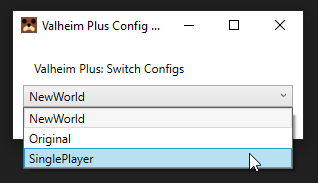

# ValheimPlus-ConfigSwitcher

## [Download ValheimPlus-ConfigSwitcher](./Release/ConfigSwitcher.zip)

Allows you to change between multiple configurations of Valheim Plus with a dropdown by naming your files as follows.

```
valheim_plus.cfg // leave original file
valheim_plus.ServerName1.cfg
valheim_plus.ServerName2.cfg
valheim_plus.SinglePlayer.cfg
```

Just extract into the Valheim Game folder next to BepInEx EG:

```
\Valheim\BepInEx
\Valheim\ConfigSwitcher
```

Run the ConfigSwitcher.exe to start selecting configs.




